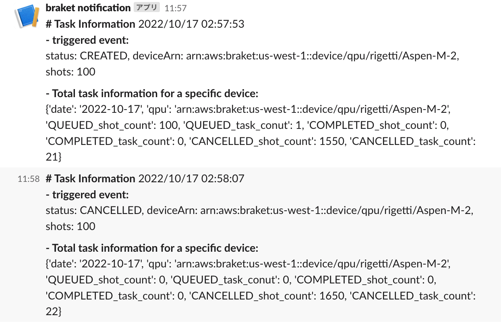

# Amazon_Braket_Monitoring_Tools

This is the Amazon Braket monitoring tool provided by Amazon. This tool deletes all tasks for a specific device when a predetermined number of Shots or a predetermined fee is reached.

## How To Use

### Prerequirements

- [AWS CLI](https://docs.aws.amazon.com/cli/latest/userguide/getting-started-install.html) with [configuration](https://docs.aws.amazon.com/cli/latest/userguide/cli-configure-quickstart.html) which have following policies:
  - AWSCloudFormationFullAccess: for deployment.
  - AmazonS3FullAccess: for saving internal-data for deployment.
  - AWSLambda_FullAccess: for deploying internal-lambda service.
  - AmazonSNSFullAccess: for deploying email notification service.
  - CloudWatchEventsFullAccess: for creating log stream and integration between AWS Braket and Lambda for internal-lambda service.
- [AWS SAM](https://pypi.org/project/aws-sam-cli/) for sam commands
- GNU make

### Install/Update steps

1. clone this repository.
2. edit Makefile parameters.

- STACKNAME: name to identify your project name in deploy step. (This is used as a AWS CloudFormation StackName.)
- REGION: AWS region name to deploy software to. (Attention: For each region you use, you have to change the region name and deploy.)
- SLACKPOSTURL: API URL used for [Slack notification](https://api.slack.com/messaging/webhooks).
- notificationEmail: your email for receiving notification from this software.
- MAXSHOTNUM: Threshold number of shots
- MAXSHOTCOST: Threshold

3. run make deploy and follow instructions to deploy.

```
$ make deploy

# changeset is shown here.

Deploy this changeset? [y/N]: y

# progress will shown here.

Successfully created/updated stack
```

4. check your email and confirm subscription from AWS Notification.

### Uninstall step

1. run make clean and follow instructions.

```
$ make clean

Are you sure you want to delete the stack <STACKNAME> in the region <REGION>? [y/N]: y
Do you want to delete the template file [some hash value].template in S3? [y/N]: y
- Deleting S3 object
- Deleting Cloudformation stack

Deleted successfully
```

2. delete Role associated with LambdaRoleArn if necessary.

### deploy Q&A

### Install step fails with ROLLBACK_COMPLETE state error

```
An error occurred (ValidationError) when calling the CreateChangeSet operation: Stack:arn:aws:cloudformation:stack/service/7e1d8c70-d60f-11e9-9728-0a4501e4ce4c is in ROLLBACK_COMPLETE state and can not be updated.
```

In this case, we need to clean all created resources for this software.
Follow Uninstall step to clean resources and try install step again.


### Note on aws lambda configuration

- 注意 1: EventBridge は自分と同じ region 内の task の status 変化しか監視しないので, region ごとに設定を行う必要があります.

- 注意 2: EventBridge は非同期呼び出しのため,発生したイベントはキューに入れられる仕様となっているため通知が送信されるまで遅延があります. また, 非同期呼び出しでは, lambda 関数呼び出しに失敗してもしなくても 2 回以上 3 回以下同じイベントが呼び出されることがあるため, 複数回通知が送信されることがあります.

### example of the slack notification




## Codes

### AmazonBraketlib class

Braket task を監視・削除する基本メソッドが含まれたクラス.

AmazonBraketlib の主なメソッド

- get_info(year, month, day, device_type, device_provider, device_name, index_of_status_type)
  指定した日付の指定したデバイスのタスクに関する情報を json 形式で出力する.
  出力される json 文字列の例は以下の通り

```
{"id": self.s3_count_id,
    "count": self.s3_shot_count_dic, "total_shots": self.total_shots_dic[self.target_name[index_of_status_type]],
    "hardware": device_provider,
    "qpu": device_name, "status": target_status,
    'date': str(year)+'-'+str(month)+'-'+str(day)
    }
```

- delete_quantumTask(quantumTaskArn_name)

QUEUED 状態の指定したタスクをキャンセルできる.

### lambda_fucntion.py

この lambda 関数は, braket に投げられた CREATED 状態の Task をイベントソースとし, 同日に投げられた QUEUED 状態の task の総 shot 数または shot 数によって発生する総金額が, あらかじめ指定した上限を超えたら, QUEUED 状態の Task を全て CANCELLED にする関数です.

cost 及び shot 数の上限は lambda_function.py の

処理の結果は slack に通知します.

slack の設定方法は[こちら](https://www.takapy.work/entry/2019/02/20/140751)
を参照してください.

### lambda_function.py 内の主要な関数

- delete_task_over_max_shot()

trigger された task の region で QUEUED されている総 shot 数が上限以上になったら, QUEUEDのtask を全て消去する lambda 関数

- delete_task_over_max_cost()

trigger された task の region で QUEUED されている総コストが上限以上になったら, QUEUEDのtask を全て消去する lambda 関数


# Reference

[Amazon Braket Developer Guide](https://docs.aws.amazon.com/ja_jp/braket/latest/developerguide/what-is-braket.html)

[EventBridge イベントパターン](https://docs.aws.amazon.com/ja_jp/eventbridge/latest/userguide/eb-event-patterns.html)

[boto3 braket api](https://boto3.amazonaws.com/v1/documentation/api/latest/reference/services/braket.html)
