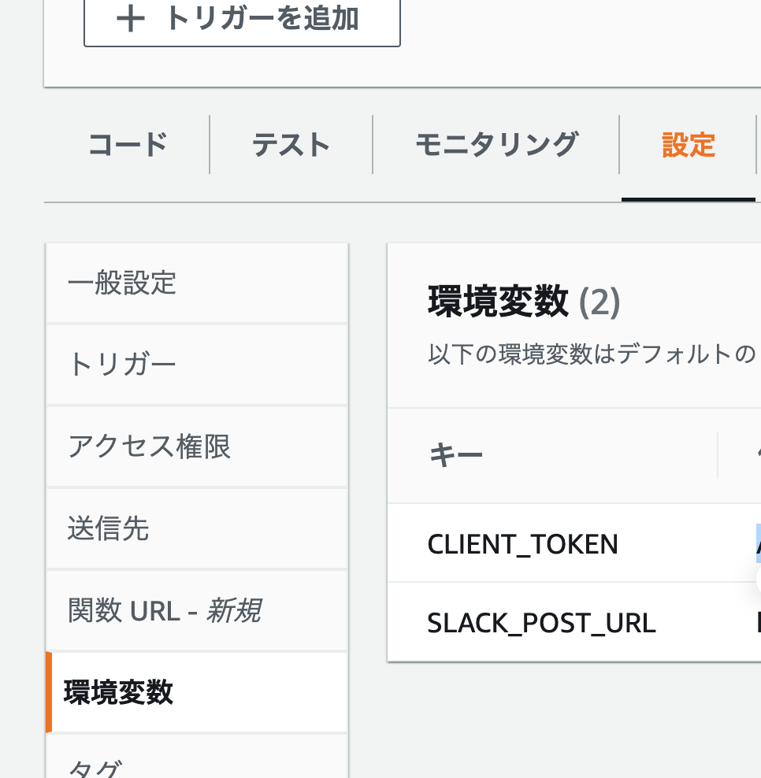

# Amazon_Braket_Monitoring_Tools
Tools to monitor Amazon Braket

このリポジトリはAmazon Braketを利用する上でのタスク監視、削除の支援ツールのコード置き場です。

## AmazonBraketlib class
Braket taskを監視・削除する基本メソッドが含まれたクラス.

AmazonBraketlibの主なメソッド

- get_info(year, month, day, device_type, device_provider, device_name, index_of_status_type)
指定した日付の指定したデバイスのタスクに関する情報をjson形式で出力する.
出力されるjson文字列の例は以下の通り
```
{"id": self.s3_count_id,
    "count": self.s3_shot_count_dic, "total_shots": self.total_shots_dic[self.target_name[index_of_status_type]],
    "hardware": device_provider,
    "qpu": device_name, "status": target_status,
    'date': str(year)+'-'+str(month)+'-'+str(day)
    }
```

- delete_quantumTask(quantumTaskArn_name)

QUEUED状態の指定したタスクをキャンセルできる.

## lambda_fucntion.py

このlambda関数は, braketに投げられたCREATED状態のTaskをイベントソースとし, 同日に投げられたQUEUED状態のtaskの総shot数またはshot数によって発生する総金額が, あらかじめ指定した上限を超えたら, QUEUED状態のTaskを全てCANCELLEDにする関数です.

cost及びshot数の上限はlambda_function.pyの

処理の結果はslackに通知します.

slackの設定方法は[こちら](https://www.takapy.work/entry/2019/02/20/140751)
を参照してください.

### AWS Lambdaの設定について
- 注意1: EventBridgeは自分と同じregion内のtaskのstatus変化しか監視しないので, regionごとにLambda と EventBridgeを設定する必要があります.

- 注意2: EventBridgeは非同期呼び出しのため,発生したイベントはキューに入れられる仕様となっています. また, 非同期呼び出しでは, lambda関数呼び出しに失敗してもしなくても2回以上3回以下同じイベントが呼び出されることがあリます.


Lambda関数を作成し, AmazonBraketlib.pyとlambda_function.pyをzip fileにまとめてuploadし,
[How to upload zip](https://docs.aws.amazon.com/ja_jp/lambda/latest/dg/python-package.html)
SLACK_POST_URL及びCLIENT_TOKENをAWS Lambdaの環境変数に設定してください.


Lambda関数には,  AmazonBraketFullAccessの権限を付与してください.

### Amazon EventBridgeの設定について

EventBridgeのイベントパターンは以下のように設定してください.
```
{
  "detail-type": ["Braket Task State Change"],
  "source": ["aws.braket"],
  "detail": {
    "status": ["CREATED"]
  }
}

```
そして, 先ほど作成したlambda関数をターゲットに指定してください.

### lambda_function.py内の主要な関数

- delete_task_over_max_shot()
shot数に応じてtaskを消去するlambda関数
- delete_task_over_max_cost()
金額に応じてtaskを消去するlambda関数


### slackの通知の形式(2022/4/10の時点で)

```
# Task Information 2022/04/10 09:32:39
from Lambda function ARN:arn:aws:lambda:us-west-1:***
- triggered event:
{'quantumTaskArn': 'arn:aws:braket:us-west-1:***', 'status': 'CREATED', 'deviceArn': 'arn:aws:braket:us-west-1::device/qpu/rigetti/Aspen-M-1', 'shots': '50', 'outputS3Bucket': 'amazon-braket-us-west-1-***', 'outputS3Directory': 'tasks/***', 'createdAt': '2022-04-10T09:32:27.370Z', 'eventName': 'INSERT'}
- triggered task information:
{'date': '2022-4-10', 'qpu': 'arn:aws:braket:us-west-1***', 'QUEUED_shot_count': 100, 'QUEUED_task_conut': 2, 'COMPLETED_shot_count': 0, 'COMPLETED_task_count': 0, 'CANCELLED_shot_count': 290, 'CANCELLED_task_count': 17}
- delete task result
['arn:aws:braket:us-west-1:***', 'arn:aws:braket:us-west-1:***']
```


## コンテナ環境

本リポジトリのDockerfile, docker-compose.ymlで作成されるコンテナは, AWSのconfig, credentialsファイルが含まれる ~/.aws/ と Amazon_Braket_Monitoring_Tools/src/ をvolumeで共有しています.

VScodeのremote-containerを用いて簡単にmfa認証のできるDocker環境が作れます.

詳しくは[aws-notebook-docker-env](https://github.com/speed1313/aws-notebook-docker-env)を参照してください.


Lambda及びEventBridgeの詳細な設定方法は, 以下のドキュメントを参照してください.
なお, コードとEventBridgeのイベントパターンは更新されていません. README及びこのリポジトリ内のコードを優先してください.

https://braketmonitor-document.s3.ap-northeast-1.amazonaws.com/index.html


# Reference
[Amazon Braket Developer Guide](https://docs.aws.amazon.com/ja_jp/braket/latest/developerguide/what-is-braket.html)

[EventBridge イベントパターン](https://docs.aws.amazon.com/ja_jp/eventbridge/latest/userguide/eb-event-patterns.html)

[boto3 braket api](https://boto3.amazonaws.com/v1/documentation/api/latest/reference/services/braket.html)


